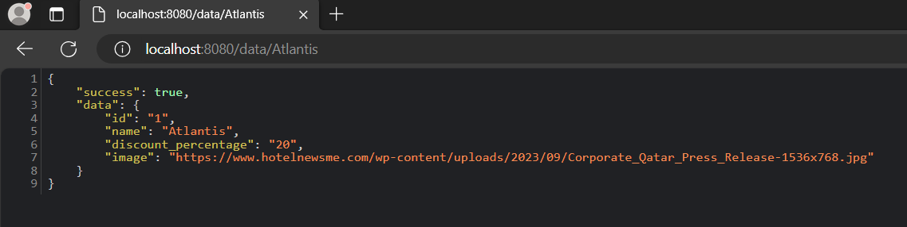

# privilee project

## Backend

### Installation 
PHP version 8.3.1 

Composer version 2.6.6

Slim Framework 4

### Usage 
To run the application in development, you can run these commands 

cd into `priv_project/server`
`composer start`

After that, open `http://localhost:8080` in your browser.

#### Endpoints
http://localhost:8080/data

http://localhost:8080/data/{hotel}
Example:

http://localhost:8080/data/{discount}

### CSV Converter
`cd src` `php CsvConverter.php your_csv_file`

## Frontend
Built using ReactJS

### Installation
Node version 18.12.1

cd into `priv_project/client` 
`npm install`

### Usage 

To run the application in development, you can run these commands 

cd into `priv_project/client`
`npm start`

After that, open `http://localhost:3002` in your browser.

## Future features
--> Filterable by both discount percentage and name at the same time

--> Still displays rest of the hotels when filtered by name 

--> Filterable using api endpoints

--> Uses xml output too 

